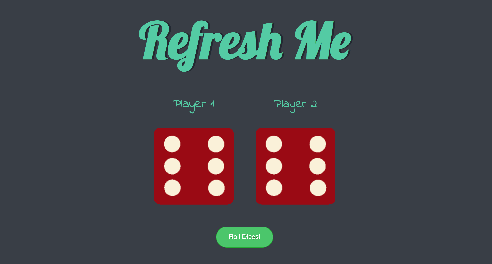

# Dicee Challenge

Did a challenge which was presented on a udemy course. Practiced basic html and css and also JS conditionals(+ switch) and DOM.

# Demo

 

# Technologies Used

HTML5, CSS, JS

# Website

https://buigabor.github.io/dicee/
